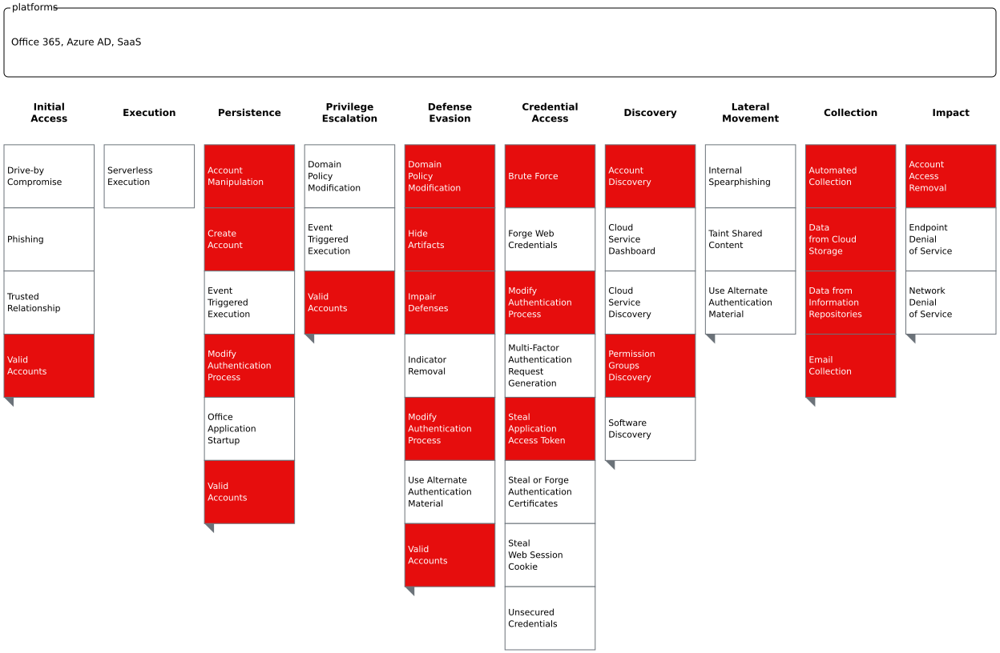

# Coverage

MAAD-AF provides testing coverage for nearly 50% of all MITRE techniques across O365, Azure AD and SaaS matrices combined.

## Coverage MAP

## Techniques List

| Tactic               | Technique ID | Technique                                                                        |
| -------------------- | ------------ | -------------------------------------------------------------------------------- |
| Collection           | T1114        | [Email Collection](https://attack.mitre.org/techniques/T1114/)                   |
| Collection           | T1213        | [Data from Information Repositories](https://attack.mitre.org/techniques/T1213/) |
| Collection           | T1119        | [Automated Collection](https://attack.mitre.org/techniques/T1119/)               |
| Collection           | T1530        | [Data from Cloud Storage](https://attack.mitre.org/techniques/T1530/)            |
| Credential Access    | T1528        | [Steal Application Access Token](https://attack.mitre.org/techniques/T1528/)     |
| Credential Access    | T1110        | [Brute Force](https://attack.mitre.org/techniques/T1110/)                        |
| Credential Access    | T1556        | [Modify Authentication Process](https://attack.mitre.org/techniques/T1556/)      |
| Defense Evasion      | T1564        | [Hide Artifacts](https://attack.mitre.org/techniques/T1564/)                     |
| Defense Evasion      | T1562        | [Impair Defenses](https://attack.mitre.org/techniques/T1562/)                    |
| Defense Evasion      | T1078        | [Valid Accounts](https://attack.mitre.org/techniques/T1078/)                     |
| Defense Evasion      | T1484        | [Domain Policy Modification](https://attack.mitre.org/techniques/T1484/)         |
| Defense Evasion      | T1556        | [Modify Authentication Process](https://attack.mitre.org/techniques/T1556/)      |
| Discovery            | T1069        | [Permission Groups Discovery](https://attack.mitre.org/techniques/T1069/)        |
| Discovery            | T1087        | [Account Discovery](https://attack.mitre.org/techniques/T1087/)                  |
| Impact               | T1531        | [Account Access Removal](https://attack.mitre.org/techniques/T1531/)             |
| Initial Access       | T1078        | [Valid Accounts](https://attack.mitre.org/techniques/T1078/)                     |
| Persistence          | T1098        | [Account Manipulation](https://attack.mitre.org/techniques/T1098/)               |
| Persistence          | T1078        | [Valid Accounts](https://attack.mitre.org/techniques/T1078/)                     |
| Persistence          | T1136        | [Create Account](https://attack.mitre.org/techniques/T1136/)                     |
| Persistence          | T1556        | [Modify Authentication Process](https://attack.mitre.org/techniques/T1556/)      |
| Privilege Escalation | T1078        | [Valid Accounts](https://attack.mitre.org/techniques/T1078/)                     |

## Open in MITRE Navigator
Download the MITRE layer file provided below to load & review MAAD-AF associated techniques in MITRE ATT&CK Navigator.

[Download MAAD-AF Navigator Layer](img/MAAD_layer.json)

[Launch MITRE ATT&CK Navigator](https://mitre-attack.github.io/attack-navigator/)

