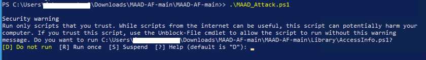

# Troubleshoot

This page documents any minor issues faced while using MAAD-AF or running the security testing, so anyone looking for a quick fix can easily find it if not elsewhere on the internet. 

To report any major issues encountered or bugs identified please [open an issue](https://github.com/vectra-ai-research/MAAD-AF/issues) on MAAD-AF Github.

### 1. PowerShell blocking execution for modules in MAAD-AF upon launch. 


#### Solution 

Step 1: Exit MAAD-AF by pressing `ctrl+c`. 

Step 2: From MAAD-AF parent directory `/MAAD-AF` in PowerShell run the following two commands: 
```
Unblock-File -Path ./MAAD_Attack.ps1

Unblock-File -Path ./Library/*
```

