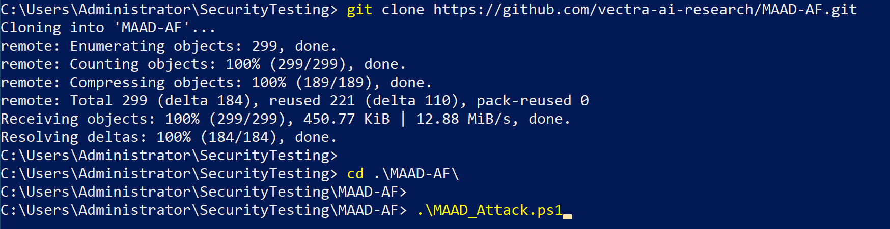
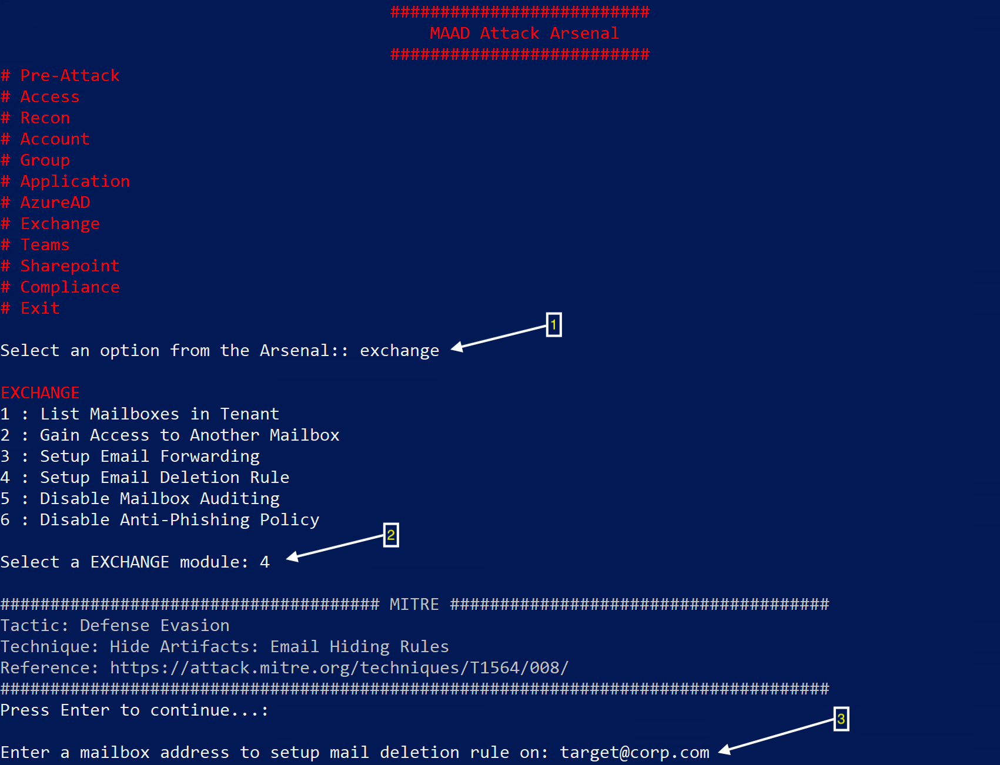

# Setup & Run
1. Open *PowerShell* as Administrator

2. [Download](https://github.com/vectra-ai-research/MAAD-AF/archive/refs/heads/main.zip) or clone latest version of MAAD-AF to your local host
> git clone [https://github.com/vectra-ai-research/MAAD-AF.git](https://github.com/vectra-ai-research/MAAD-AF.git)

3. Navigate to the downloaded MAAD-AF directory
> cd /MAAD-AF

4. Launch MAAD-AF
> ./MAAD_Attack.ps1

That's it! :)



## Interacting with MAAD-AF

Interacting with MAAD-AF follows a simple workflow for all techniques:

```
MAAD Attack Arsenal -> Primary Module name -> Sub-Module # choice -> Follow prompts to execute
```

1. From *MAAD Attack Arsenal*, select a *Primary Module* by typing its name, eg: "Access"
2. Enter the sub-module number from the list to select the technique/sub-module, eg: 2
3. Follow on-screen prompts to execute the technique



## Executing Your First MAAD-AF Module
1. Launch MAAD-AF by typing below command in PowerShell from MAAD-AF directory
> ./MAAD_Attack.ps1
2. Hit `Enter` to agree to the consent and continue
3. Wait for dependency check to complete. If MAAD-AF prompts you of any missing modules, enter `Yes` to 'Automatically install missing modules? (Yes / No)'
4. Type `No` and press `Enter` for prompt '*Do you want to keep your traffic anonymous?*' (You can learn more about this option here and choose `Yes` in subsequent runs)
5. Welcome to *MAAD Attack Arsenal* which displays all the primary MAAD-AF attack modules
6. Type `access` (case insensitive) and press `Enter` to select the "*Access*" module
7. Type `1` and press `Enter` to select sub-module "*1*" from the list.
8. Enter your testing credentials by following the on-screen prompts
9. MAAD-AF will attempt to access various Microsoft cloud services based on the access & privilege of the credential supplied. 

**Congratulations! You successfully executed your first MAAD-AF module attempting initial access to Microsoft cloud services.**


# Special Keywords
MAAD-AF special commands allows users to execute certain frequently used functions without navigating through options heirarchy. As you start to perform more frequent testing these special commands will come handy to make your use of MAAD-AF more speedy and enjoyable. These commands can also be referenced directly within MAAD-AF by typing `HELP`in the *MAAD Attack Arsenal* menu. Alternatively, you can continue to use MAAD-AF without ever using any of these special keywords. 

| MAAD-AF Special Keywords | Description                                                                                             |
| ---------------- | ------------------------------------------------------------------------------------------------------- |
| SHOW ALL         | Expand all options in MAAD Attack Arsenal for a full list of options.                                   |
| ADD CREDS        | Add new credentials to the MAAD-AF credentials store for quickly establishing access later.             |
| SHOW CREDS       | Show all credentials collected in MAAD-AF credentials store.                                            |
| ESTABLISH ACCESS | Initiate access attempt to Micrsoft services using stored or new credentials.                           |
| SWITCH ACCESS    | Use another credential from Credential Store to establish access in modules                             |
| ACCESS INFO      | Display details about my current access session                                                         |
| KILL ACCESS      | Terminate all active connections                                                                        |
| EXECUTE RECON    | Gather all information from the environment using the current access and MAAD-AF reconnaissance modules |
| EXIT             | Exit MAAD-AF without closing active access connections.                                                 |
| FULL EXIT        | Exit MAAD-AF and close all active access connections.                                                   |