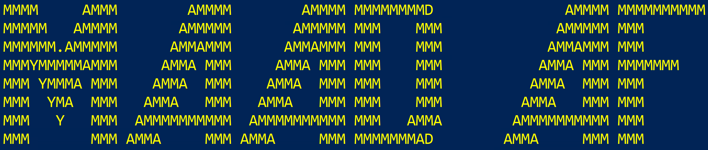

# MAAD Attack Framework

## **MAAD-AF** is an open-source cloud attack tool for Microsoft 365 & Entra ID(Azure AD) environments.

* Designed with the goal to make security testing - Simple, Fast & Effective!
* Easily & swiftly execute attack modules exploiting EntraID/M365 services.
* Emulate breach / identity compromise in Microsoft cloud environments.
* Effectively validate efficacy of security controls and detection & response capabilities against real cyber threats.

MAAD-AF is developed to tackle the common challenges preventing or limiting effective & frequent cloud security testings. Cost, complex processes, infrequency, lack of expertise, infrastructure impact are some of the challenges that currently rig effective security testing. 

## Why Get MAAD-AF? 

### Simple
MAAD-AF is designed to simplify security testing so everyone and anyone can use it from red team professionals to detection engineers to non-practitioners learning attacks in cloud. With no-command & intuitive prompt based workflow, MAAD-AF delivers a simple framework that makes it easy to understand and execute attack techniques. You can almost ignore this documentation :) 

### Fast
Test with 30+ [attack modules](MAAD-AF Modules/index.md) in under an hour.

MAAD-AF's design allows for virtually no-setup process and no special requirements. Combined with no-command & fully interactive workflow users can simply download and start testing their environments with MAAD-AF in no time.

### Effective
MAAD-AF follows and executes techniques captured in MITRE ATT&CK. Run effective security testing by testing against techniques commonly used by attackers in the wild & against frequently targeted cloud services. 

By making security testing process simple, fast & effective, MAAD-AF aims to enable more organizations & individuals to perform security testing, and promote frequent and effective security testing practices.

## Key Features
- **Extensive Testing Coverage** : 30+ attack modules (~50% of MITRE techniques) ranging from initial access, persistence, privilege escalation, defense evasion, credential access, exfiltration, and impact.
- **Effective Testing** : Test against techniques frequently used by adversaries & leverage living-off-the-land methods.
- **Ready Out-of-the-Box** : No-setup process. Download and start testing.
- **Intutive at its Core** : No-commands and a fully interactive prompt-based interface.
- **Clean Testing** : Show your cloud some love - revert most actions executed and keep testing impact to minimal.
- **Tool for Everyone** : A security tool for everyone who wishes to benefit from effective security testing - from red team professionals to detection engineers validating D&R capabilities to students & future practitioners learning cloud security. 